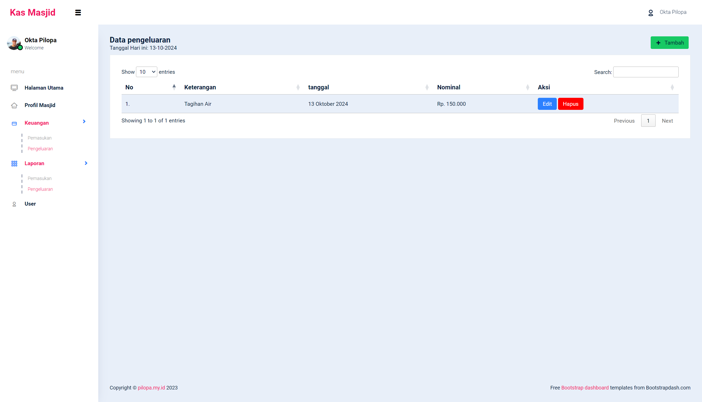

# kasmasjid
aplikasi sistem informasi pencatatan keuangan masjid menggunakan php dan laravel 10

## Persiapan
- PHP 8.2
- Laravel 10
- MySql

## Langkah - Langkah
- Clone project
- Buat database contoh: db_kasmasjid
- Jalankan composer install
- Jalankan php artisan migrate
- Jalankan php artisan serve
- Buka browser dan akses http://localhost:8000

## Screenshot

1. halaman 1

2. halaman 2

3. halaman 3

4. halaman 4

5. halaman 5

6. halaman 6

7. halaman 7

8. halaman 8

## Penutup
Support saya untuk terus berbagi, dengan mendoakan saya dan keluarga selalu dalam keadaan sehat, diampuni dosa, dimurahkan rejeki, selamat dari siksa kubur, dimudahkan segala urusan, dijamin masuk surga. Amiiin

Jika ingin berbagi sedikit rejeki berikut saya lampirkan akun dana saya 0816564142

Terimakasih !

